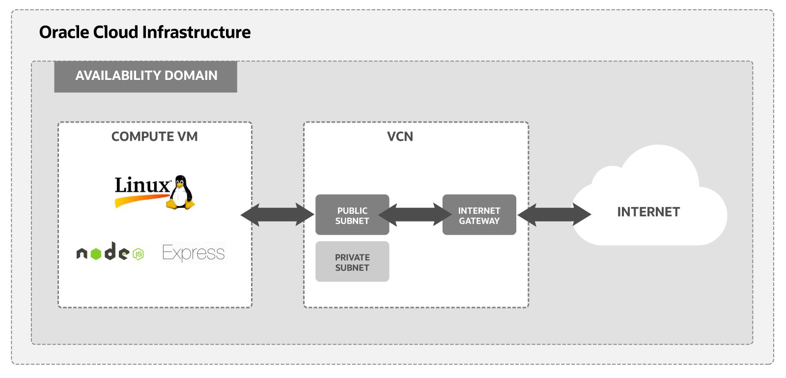
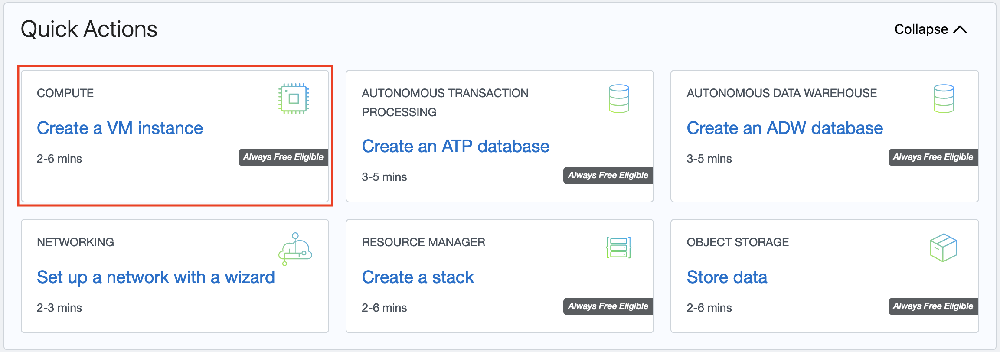


In this tutorial, we'll use an Oracle Cloud Infrastructure Free Tier account to set up an Oracle Linux Compute instance. We'll install a Node Express application and access your new app from the internet. Finally, we'll cover all the steps necessary to set up a virtual network for your host and connect the host to the internet.

Key tasks include how to:

* Set up a compartment for your development work
* Install your Oracle Linux instance and connect it to your Virtual Cloud Network (VCN)
    * Set up an Oracle Cloud Infrastructure Virtual Cloud Network and related network services required for your host to connect to the internet
    * Set up `ssh` encryption keys to access your Oracle Linux Server
* Configure ingress rules for your VCN
* Configure NodeJS with an Express framework on your instance

Here is a simplified diagram of the setup for your Linux instance.



For additional information, see:

* [Signing Up for Oracle Cloud Infrastructure](https://docs.oracle.com/iaas/Content/GSG/Tasks/signingup.htm)
* [Launch your first Linux VM](https://docs.oracle.com/iaas/Content/GSG/Reference/overviewworkflow.htm)

## Before You Begin

To successfully complete this tutorial, you must have the following:

* An Oracle Cloud Infrastructure Free Tier account: [Start for Free]({{ site.urls.always_free }})
* A MacOS, Linux, or Windows computer with `ssh` support installed

## Set up a Compartment for Development

Configure a compartment for your development.

### Create a Compartment

Create a compartment for the resources that you create in this tutorial.

1. Log in to the Oracle Cloud Infrastructure **Console**.
2. Open the navigation menu and click **Identity & Security**. 
3. Under **Identity**, click **Compartments**.
3. Click **Create Compartment**.
4. Fill in the following information:
    * **Name:** `<your-compartment-name>`
    * **Description:** `Compartment for <your-description>.`
    * **Parent Compartment:** `<your-tenancy>(root)`
5. Click **Create Compartment**.

**Reference:** [Create a compartment](https://docs.oracle.com/iaas/Content/Identity/Tasks/managingcompartments.htm#To)

## Install your Oracle Linux Instance

Use the **Create a VM Instance** wizard to create a new compute instance.

The wizard does several things when installing the instance:

* Creates and installs a compute instance running Oracle Linux
* Creates a VCN with the required subnet and components needed to connect your Oracle Linux instance to the internet
* Creates an `ssh` key pair you use to connect to your instance

### Review Installation Steps

To get started with installing your instance using the **Create a VM Instance** wizard, follow these steps:

1. From the main landing page, select **Create a VM Instance**. 
    
    

    The **Create Compute Instance** page is displayed. It has a section for **Placement**, Image and shape, **Networking**, **Add SSH keys**, and **Boot volume**.

2. Choose the **Name** and **Compartment**.

    **Initial Options**

    * **Name:** <name-for-the-instance>
    * **Create in compartment:** <your-compartment>

    Enter a value for the name or leave the default.

3. Review the **Placement** settings. Accept the default values provided by the wizard.

    > The following is sample data. The actual values change over time or differ based on data center.
    {:.notice}

    **Placement**

    * **Availability domain:** AD-1
    * **Capacity type:** On-demand capacity.
    * **Fault domain:** Oracle chooses the best placement.

    > For Free Tier, use **Always Free Eligible** option for availability domain.
    {:.notice}

4. Review the Image and shape settings. Accept the default values provided by the wizard.

    > The following is sample data. The actual values change over time or differ based on data center.
    {:.notice}

    **Image**

    * **Image:** Oracle Linux 7.9
    * **Image build:** 2020.11.10-1

    **Shape**

    * **Shape:** VM.Standard.E2.1.Micro
    * **OCPU count:** 1
    * **Memory (GB):** 1
    * **Network bandwidth (Gbps):** 0.48

        > **Note:** For Free Tier, use **Always Free Eligible** shape options.
        {:.notice}

5. Review the **Networking** settings. Accept the default values provided by the wizard.

    > The following is sample data. The actual values change over time or differ based on data center.
    {:.notice}

    * **Virtual cloud network:** vcn-\<date>-\<time>
    * **Subnet:** vcn-\<date>-\<time>
    * **Assign a public IPv4 address:** Yes

6. Review the **Add SSH keys** settings. Take the default values provided by the wizard.

    * Select the _Generate a key pair for me_ option
    * Click _Save Private Key_ and _Save Public Key_ to save the private and public SSH keys for this compute instance

    If you want to use your own SSH keys, select one of the options to provide your public key.

    > Put your private and public key files in a safe location. You cannot retrieve keys again after the compute instance has been created.
    {:.notice}

7. Review the **Boot volume** settings. Accept the default values provided by the wizard.

    Leave all check boxes **unchecked**.

8. Click **Create** to create the instance. Provisioning the system might take several minutes.

You have successfully created an Oracle Linux instance.

## Enable Internet Access

The **Create a VM Instance** wizard automatically creates a VCN for your instance. We'll add an ingress rule to the subnet to allow internet connections on port 3000.

### Create an Ingress Rule for your VCN

Follow these steps to select your VCN's public subnet and add the ingress rule:

1. Open the navigation menu and click **Networking**, then click **Virtual Cloud Networks**
2. Select the VCN you created with your compute instance
3. With your new VCN displayed, click **\<your-subnet-name>** subnet link.

    The public subnet information is displayed with the Security Lists at the bottom of the page. A link to the **Default Security List** for your VCN is displayed.

4. Click the **Default Security List** link

    The default **Ingress Rules** for your VCN are displayed.

5. Click **Add Ingress Rules**

    An **Add Ingress Rules** dialog is displayed

6. Fill in the ingress rule with the following information:

    * **Stateless:** Checked
    * **Source Type:** CIDR
    * **Source CIDR:** 0.0.0.0/0
    * **IP Protocol:** TCP
    * **Source port range:** (leave-blank)
    * **Destination Port Range:** 3000
    * **Description:** Allow HTTP connections

7. Click **Add Ingress Rule**

Now HTTP connections are allowed. Your VCN is configured for Node Express, and you have successfully created an ingress rule that makes your instance available from the internet.

## Create a Node Express Application

Next, set up an Express framework on your Oracle Linux instance, then create and run a NodeJS application.

### Install and Set up Node Express

Follow these steps to set up your instance and build your application:

1. Open the navigation menu and click **Compute**. Under **Compute**, click **Instances**
2. Click the link to the instance you created in the previous step

    From the **Instance Details** page, look in the **Instance Access** section. Copy the public IP address the system created for you. You use this IP address to connect to your instance.

3. Open a **Terminal** or **Command Prompt** window
4. Change into the directory where you stored the `ssh` encryption keys you created for this tutorial
5. Connect to your instance with this SSH command

    ```console
    $ ssh -i <your-private-key-file> opc@<x.x.x.x>
    ```

    Since you identified your public key when you created the instance, this command logs you into your instance. You can now issue `sudo` commands to install and start your server.

6. Enable HTTP connection on port 3000

    ```console
    $ sudo firewall-cmd --permanent --add-port=3000/tcp
    $ sudo firewall-cmd --reload
    ```

7. Install the latest version of NodeJS

    ```console
    $ sudo yum update
    $ sudo yum install -y oracle-nodejs-release-el7
    $ sudo yum install -y nodejs
    $ node --version
    ```

8. Create a directory for your application
    
    ```console
    $ mkdir node-hello-app
    ```

9. Change to the `node-hello-app` directory
    
    ```console
    $ cd node-hello-app
    ```

10. Use `npm` to create a `package.json` file
    
    ```console
    $ npm init
    ```

    Enter information as follows:

    * **name:** node-hello-app
    * **version:** 1.0.0
    * **description:** Node Express Hello application
    * **entry point:** app.js (Don't use the default.)
    * **test command:** (leave-blank)
    * **git repository:** git://github.com/username/repository.git (or replace with a valid git repository)
    * **keywords:** (leave-blank)
    * **author:** Example User username@example.com
    * **license:** UPL-1.0

    Preview what you get in `package.json`
    
    ```console
    About to write to /home/opc/node-hello-app/package.json:
    
    {
      "name": "node-hello-app",
      "version": "1.0.0",
      "description": "Node Express Hello application",
      "main": "app.js",
      "scripts": {
        "test": "echo \"Error: no test specified\" && exit 1"
      },
      "repository": {
        "type": "git",
        "url": "git://github.com/username/repository.git"
      },
      "author": "Example User username@example.com",
      "license": "UPL-1.0",
      "bugs": {
        "url": "https://github.com/username/repository/issues"
      },
      "homepage": "https://github.com/username/repository#readme"
    }
    ```
    

    Enter **yes** to approve your answers. 

11. Install Express and save it in the dependencies list of `package.json`

    ```console;
    $ npm install express --save
    ```

12. Verify that express is added as a dependency in `package.json`

    ```console
    $ cat package.json
    
    "dependencies": {
        "express": "^4.17.1"
    }
    ```

13. Create a "Hello, World!" application

    Create the file:

    ```console
    $ vi app.js
    ```

    In the file, input the following text and save the file:

    ```javascript
    const express = require('express')
    const app = express()

    app.get('/', function (req, res) {
      res.send('Hello World!')
    })

    app.listen(3000, function() {
      console.log('Hello World app listening on port 3000!');
    })
    ```

14. Run the NodeJS program

    ```console
    $ node app.js
    ```

15. Test the application using the command line or a browser

    * To test with `curl`, from a new terminal, connect to your Ubuntu instance with your SSH keys, and then on the command line enter: `curl -X GET http://localhost:3000`
    * From a browser, connect to the public IP address assigned to your instance: http://\<x.x.x.x>:3000

    The Node app returns `Hello World!` in your instance or your browser.

You have successfully created a local NodeJS application in an Express framework on an Oracle Cloud Infrastructure instance.

**References:**

For more information on Express, see:

* [Installing Express](https://expressjs.com/en/starter/installing.html)
* [Getting Started with Express](https://expressjs.com/en/starter/hello-world.html)

## What's Next

You have successfully installed and deployed a Node Express app on Oracle Cloud Infrastructure using a Linux instance.

To explore more information about development with Oracle products:

* [Oracle Developers Portal](https://developer.oracle.com/)
* [Oracle Cloud Infrastructure](https://www.oracle.com/cloud/)

