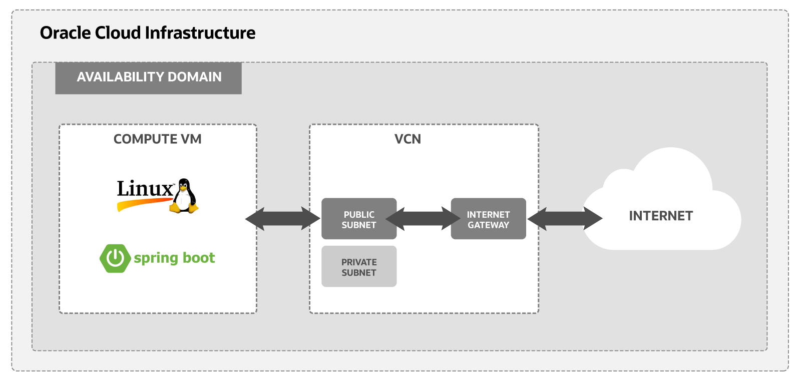
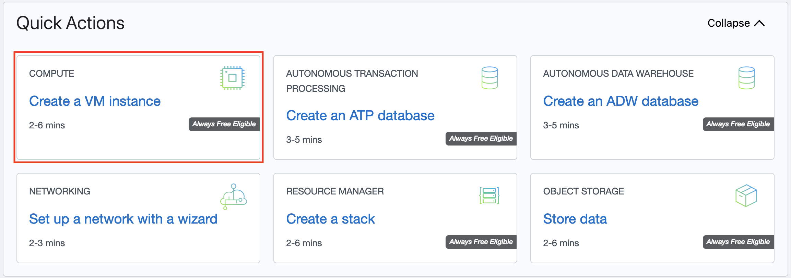



In this tutorial, you'll use an Oracle Cloud Infrastructure Free Tier account to set up an Oracle Linux compute instance, install a Spring Boot application, and then configure it to be accessible from the internet. This tutorial also covers all the steps necessary to set up a virtual network for your host and connect the host to the internet.

Key tasks include how to:

* Set up a compartment for your development work.
* Install your Oracle Linux instance and connect it to your Virtual Cloud Network (VCN). 
    * Set up an Oracle Cloud Infrastructure virtual cloud network and related network services required for your host to connect to the internet.
    * Set up `ssh` encryption keys to access your Oracle Linux Server.
* Configure ingress rules for your VCN.
* Configure Spring Boot on your instance.
* Connect to your instance from the internet.

Below is a simplified diagram of the setup for your Linux instance.



For additional information, see:

* [Signing Up for Oracle Cloud Infrastructure](https://docs.oracle.com/iaas/Content/GSG/Tasks/signingup.htm)
* [Launch your first Linux VM](https://docs.oracle.com/iaas/Content/GSG/Reference/overviewworkflow.htm)

## Before you begin

To successfully complete this tutorial, you must have the following:

### Requirements

* An Oracle Cloud Infrastructure Free Tier account. [Start for Free]({{ site.urls.always_free }}).
* A MacOS, Linux, or Windows computer with `ssh` support installed.

## Set up a compartment for development

Configure a compartment for your development.

### Create a compartment

Create a compartment for the resources that you create in this tutorial.

1. Log in to the Oracle Cloud Infrastructure **Console**.
2. Open the navigation menu and select **Identity & Security**. Under **Identity**, select **Compartments**.
3. Select **Create Compartment**.
4. Fill in the following information:
    * **Name:** `<your-compartment-name>`
    * **Description:** `Compartment for <your-description>.`
    * **Parent Compartment:** `<your-tenancy>(root)`
5. Select **Create Compartment**.

**Reference:** [Create a compartment](https://docs.oracle.com/iaas/Content/Identity/Tasks/managingcompartments.htm#To)

## Install your Oracle Linux Instance

Use the **Create a VM Instance** wizard to create a new compute instance.

The wizard does several things when installing the instance:

* Creates and installs a compute instance running Oracle Linux.
* Creates a VCN with the required subnet and components needed to connect your Oracle Linux instance to the internet.
* Creates an `ssh` key pair you use to connect to your instance.

### Review installation steps

To get started installing your instance with the **Create a VM Instance** wizard, follow these steps:

1. From the main landing page, select **Create a VM instance** wizard. 

    The **Create Compute Instance** page is displayed. It has a section for **Placement**, Image and shape, **Networking**, **Add SSH keys**, and **Boot volume**.

2. Choose the **Name** and **Compartment** for the instance.

    **Initial Options**

    * **Name:** `<name-for-the-instance>`
    * **Create in compartment:** `<your-compartment>`

    Either enter a value for the **Name** or leave the system-supplied default.

3. Review the **Placement** settings. Accept the default values provided by the wizard.

    > The following is sample data. The actual values change over time and differ from data center to data center.
    {:.notice}

    **Placement**

    * **Availability domain:** AD-1
    * **Capacity type:** On-demand capacity.
    * **Fault domain:** Oracle chooses the best placement.

    > For Free Tier, use the **Always Free Eligible** option for **Availability domain**.
    {:.notice}

4. Review the Image and shape settings. Accept the default values provided by the wizard.

    > The following is sample data. The actual values change over time and differ from data center to data center.
    {:.notice}

    **Image**

    * **Image:** Oracle Linux 7.9
    * **Image build:** 2020.11.10-1

    **Shape**

    * **Shape:** VM.Standard.E2.1.Micro
    * **OCPU count:** 1
    * **Memory (GB):** 1
    * **Network bandwidth (Gbps):** 0.48

    > For Free Tier, use **Always Free Eligible** for the **Shape** options.
    {:.notice}

5. Review the **Networking** settings. Aceept the default values provided by the wizard.

    > The following is sample data. The actual values change over time and differ from data center to data center.
    {:.notice}

    * **Virtual cloud network:** `vcn-<date>-<time>`
    * **Subnet:** `vcn-<date>-<time>`
    * **Assign a public IPv4 address:** Yes

6. Review the **Add SSH keys** settings. Accept the default values provided by the wizard.

    * Select the **Generate a key pair for me** option.
    * Select both the **Save Private Key** and **Save Public Key** options to save the private and public SSH keys for this compute instance.

    If you want to use your own SSH keys, select one of the options to provide your public key.

    > **Put your private and public key files in a safe location.** You cannot retrieve your SSH keys after the compute instance has been created.
    {:.notice}

7. Review the **Boot volume** settings. Accept the default values provided by the wizard.

    Leave all check boxes **unchecked**.

8. Select **Create** to create the instance. Provisioning the system might take several minutes.
You have successfully created an Oracle Linux instance.

## Enable internet access

The **Create a VM Instance** wizard automatically creates a VCN for your instance. You must manually add an ingress rule to your subnet to allow internet connections on port 8080.

### Create an ingress rule for your VCN

Follow these steps to select your VCN's public subnet and add the ingress rule.

1. Open the navigation menu and select **Networking**.
2. Select **Virtual Cloud Networks**.
3. Select the VCN you created with your compute instance.
4. With your new VCN displayed, select `<your-subnet-name>` subnet link.

    The public subnet information is displayed with the **Security Lists** at the bottom of the page. A link to the **Default Security List** for your VCN is displayed.

5. Select the **Default Security List** link.

    The default **Ingress Rules** for your VCN are displayed.

6. Select **Add Ingress Rules**.

    An **Add Ingress Rules** dialog is displayed.

7. Fill in the ingress rule with the following information.

    Fill in the ingress rule as follows:

    * **Stateless:** Checked
    * **Source Type:** CIDR
    * **Source CIDR:** 0.0.0.0/0
    * **IP Protocol:** TCP
    * **Source port range:** (leave-blank)
    * **Destination Port Range:** 8080
    * **Description:** Allow HTTP connections

8. Select **Add Ingress Rule**.

    Now HTTP connections are allowed. Your VCN is configured for Spring Boot.

    You have successfully created an ingress rule that makes your instance available from the internet.

## Install and configure Spring Boot

Before the Spring Boot application is ready to use, you first configure the instance you created previously and then install 3 software packages, Git, OpenJDK 8, and Maven 3.6.

### Before you begin

#### Configure the port for your instance

1. Open the navigation menu and select **Compute**. Under **Compute**, select **Instances**.
2. Select the link to the Instance you created earlier.

    From the **Instance Details** page look under the **Instance Access** section. Save the public IP address the system created for you. You use this IP address to connect to your instance.

3. Open a **Terminal** or **Command Prompt** window.
4. Navigate to the directory where you stored the `ssh` encryption keys you created.
5. Connect to your instance with the SSH command 

    ```console
    $ ssh -i _<your-private-key-file>_ opc@_<x.x.x.x>_
    ```

    Since you identified your public key when you created the instance, this command logs you into your instance. You can now issue `sudo` commands to install and start your server.

6. Enable an HTTP connection on port 8080. 

    ```console
    $ sudo firewall-cmd --permanent --add-port=8080/tcp
    $ sudo firewall-cmd --reload
    ```

    The firewall is configured for Spring Boot.

#### Install Git

Install Git v2 from the [IUS Community Project](https://ius.io/). On the site, navigate to the current version of the Git core package and then download to a local `~/temp` directory.

Downloading the Git RPM looks similar to the following:

 ```console
 $ cd
 $ mkdir temp
 $ cd ~/temp
 $ wget https://repo.ius.io/7/x86_64/packages/g/git224-core-2.24.2-1.el7.ius.x86_64.rpm                        
 ```

Once the Git RPM download has completed, install the RPM.

1. Install the RPM with `yum`.
    
    ```console
    $ sudo yum install git224-core-2.24.2-1.el7.ius.x86_64.rpm
    ```

2. Test for sucessful install.

    ```console
    $ git --version
    ```

    If the installation was successful, `git --version` will echo something similar to the following:

    ```
    git version 2.24.2
    ```

 Git is installed.

#### Install OpenJDK 8

1. Install OpenJDK 8 using `yum`.

    ```console
    $ sudo yum install java-1.8.0-openjdk-devel
    $ java -version
    ```

1. Set `JAVA_HOME` in `.bashrc`. 

    1. Update .bashrc:
    
       ```console
       $ vi ~/.bashrc
       ```

       In the file, append the following text and save the file:

       ```bash
       # set JAVA_HOME
       export JAVA_HOME=/etc/alternatives/java_sdk
       ```

   1. Activate the preceding command in the current window.
    
       ```console
       $ source ~/.bashrc
       ```

Java is installed.

#### Install Maven 3.6

Install Maven from an Apache mirror. Go to the main Maven site's [download page](https://maven.apache.org/). Get the URL for the latest version and download with wget.

1. Download the Maven zip file.
   For example:

    ```console
    $ wget http://apache.mirrors.pair.com/maven/maven-3/3.6.3/binaries/apache-maven-3.6.3-bin.tar.gz
    ```

2. Extract the program files.

    ```console
    $ sudo tar xvfz apache-maven-3.6.3-bin.tar.gz
    ```

3. Install the program files by moving the files to the `/opt` directory.
    
    ```console
    sudo mv apache-maven-3.6.3 /opt/
    ```

4. Add the Maven path `/opt/apache-maven-3.6.3/bin` to your `PATH` environment variable and source your `.bashrc`.

    ```console
    $ vi ~/.bashrc
    ```

    Add `export PATH=$PATH:/opt/apache-maven-3.6.3/bin` and save.

    ```console
    $ source ~/.bashrc
    ```

Maven is ready to use.

### Build your Spring Boot application

Follow these steps to set up your Spring Boot application:

1. From your home directory check out the Spring Boot Docker guide with Git:

    ```console
    $ git clone http://github.com/spring-guides/gs-spring-boot-docker.git
    ```

2. Navigate to the `gs-spring-boot-docker/initial` directory.
3. Edit the `Application.java` file located in `src/main/java/hello/`.
4. Update `Application.java` with the following:

    ```java
    package hello;
    
    import org.springframework.boot.SpringApplication;
    import org.springframework.boot.autoconfigure.SpringBootApplication;
    import org.springframework.web.bind.annotation.RequestMapping;
    import org.springframework.web.bind.annotation.RestController;
    
    @SpringBootApplication
    @RestController
    public class Application {
    
        @RequestMapping
        public String home(){
            return "<h1>Spring Boot Hello World!</h1>";
        }
        
        public static void main(String[] args) {
            SpringApplication.run(Application.class, args);
        }
        
    }
    ```

5. Save the file.
6. Use Maven to build the application.
    
    ```console
    $ mvn package
    ```

    If the build is successful, Maven will echo:
    
    ```console
    [INFO] BUILD SUCCESS
    ```

7. Run the application.

    ```console
    $ java -jar target/gs-spring-boot-docker-0.1.0.jar
    ```

8. Test your application from the command line or a browser.

    * From a new terminal, connect to your instance with your SSH keys and test with curl:

        ```console
        $ curl -X GET http://localhost:8080
        ```

    * From your browser, connect to the public IP address assigned to your instance: **http://\<x.x.x.x>:8080**.

    On either your instance or in your browser, you see 
    >**Spring Boot Hello World!**

Congratulations! You have successfully created a Spring Boot application on your instance.

## What's Next

You have successfully installed and deployed a Spring Boot application on Oracle Cloud Infrastructure using a Linux instance.

To explore more information about development with Oracle products:

* [Oracle Developers Portal](https://developer.oracle.com/)
* [Oracle Cloud Infrastructure](https://www.oracle.com/cloud/)


