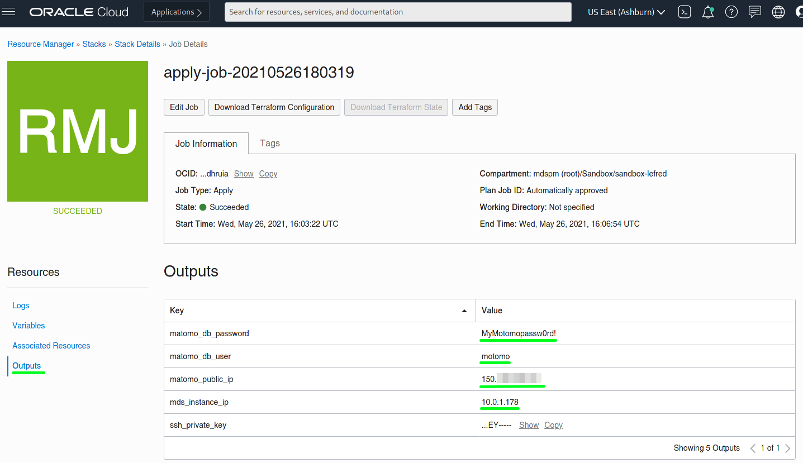
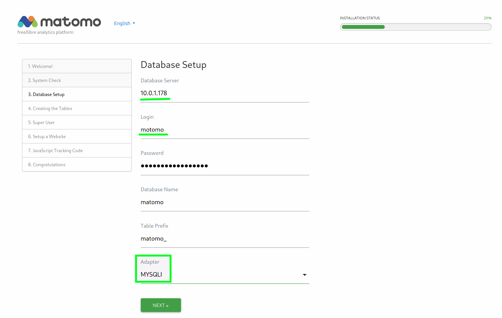
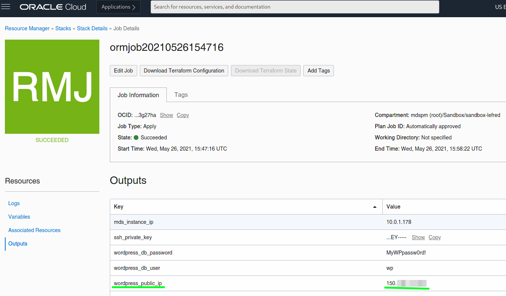
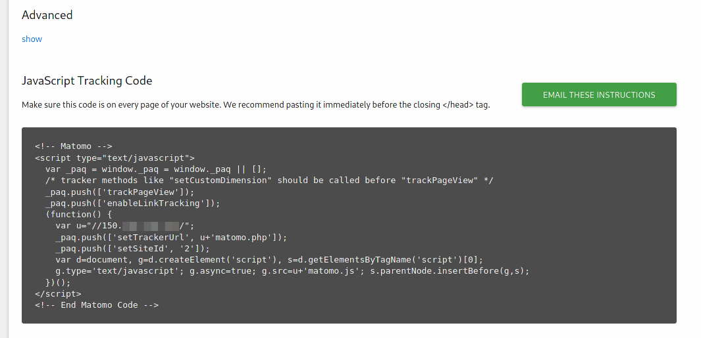
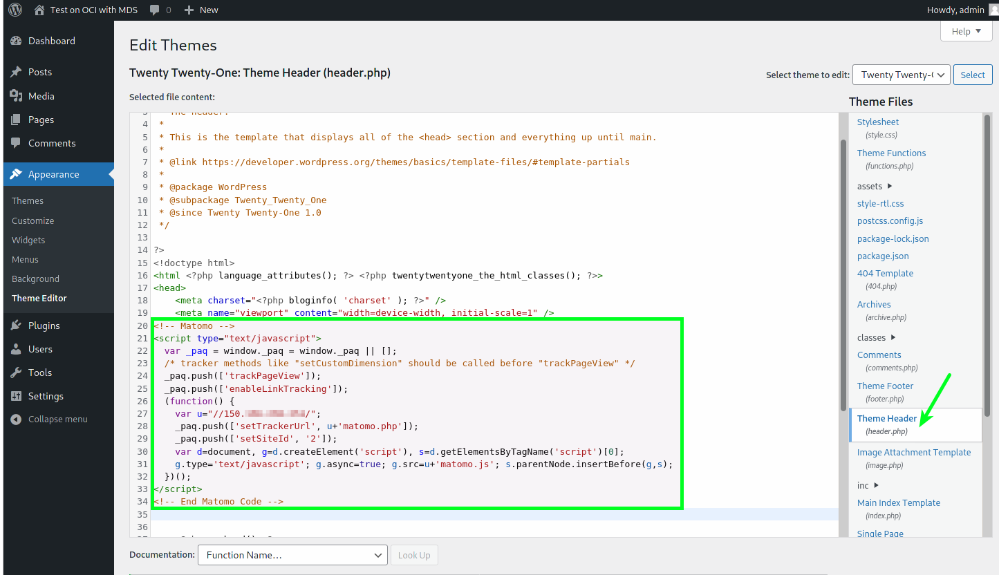

[Matomo](https://matomo.org/) is a Google Analytics alternative for tracking metrics on your websites. If you follow my blog, you know how easy it’s to deploy popular Open Source web solutions like WordPress, Joomla!, Drupal, Moodle, and Magento on OCI. If this is not yet your case, please check this page: [deploy on OCI](https://matomo.org/).

All these solutions are using MySQL Database Service to store their data.

I’ve recently added a [new stack](https://github.com/lefred/oci-matomo-mds) to also deploy Matomo. Of course this can be a standalone installation to collect all your analytics from self-hosted websites, but today I will describe how to use it with an existing stack we already deployed on OCI.

For this example, I deployed WordPress using the following stack: [oci-wordpress-mds](https://github.com/lefred/oci-wordpress-mds).

The first step is to deploy [Matomo on OCI](https://www.oracle.com/cloud/sign-in.html?redirect_uri=https%3A%2F%2Fcloud.oracle.com%2Fresourcemanager%2Fstacks%2Fcreate%3FzipUrl%3Dhttps%3A%2F%2Fgithub.com%2Flefred%2Foci-matomo-mds%2Freleases%2Fdownload%2Fv1.0.0%2Fstack_matomo_mds.zip).

In the second screen of the Stack’s wizard, we specify that we want to use an existing infrastructure. Doing this we won’t recreate new VCN, subnets, security lists, Internet Gateway, …. we want share what we already deployed for WordPress:

As you can see for the majority of the input fields, we need to provide the OCID. These can be found on the OCI’s dashboard. For example the OCID for the MySQL Database can be found here:

We do this for every resources we want to reuse.

Then we create an apply job for the stack and when done we can get the public IP and other necessary information in the output section:

We can then enter the public IP in a browser and finish the installation:

It’s important to use the right connector/adapter: `MYSQLI`.

Then we follow the wizard and enter the required information.

When done, we can add our WordPress in Matomo to start tracking it. The first step is the retrieve its name (in our case, its public IP as I don’t use DNS):

Once added in Matomo, we can retrieve the javascript code used to track our website:

We copy that code and we go in the admin dashboard of our WordPress site to modify the theme and add the previous code in the header file:

And this is all we needed to be able to get analytics of our website we deployed on OCI.

